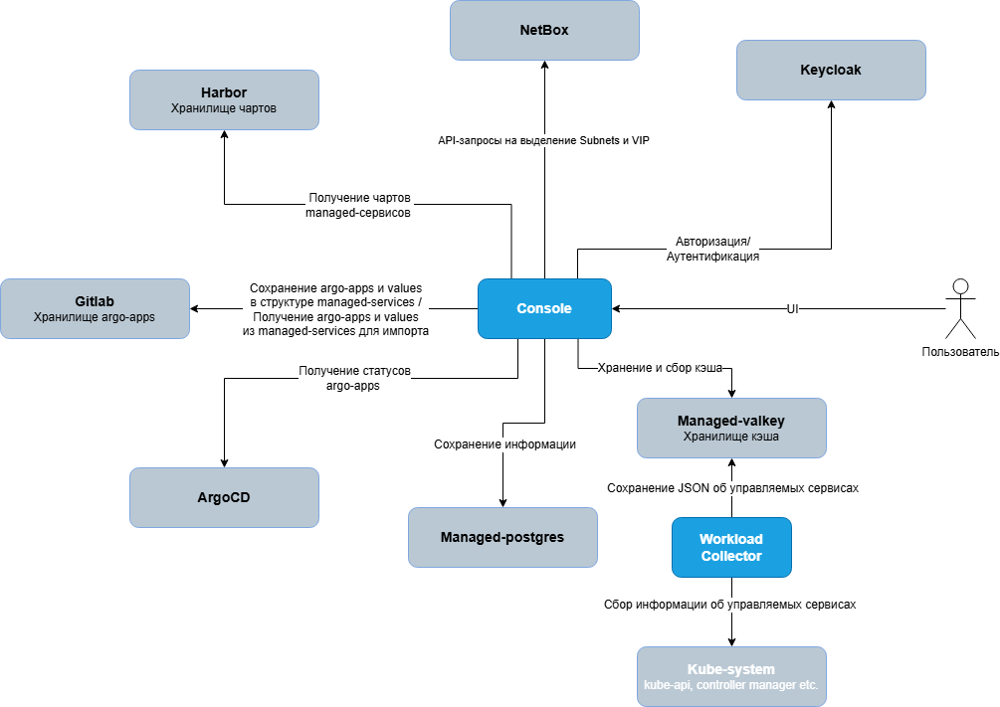

# Архитектура и интеграции

Эта страница показывает, из чего состоит платформа и с какими внешними системами работает портал (Console). Она помогает понять, что происходит «под капотом», когда вы заказываете и наблюдаете сервисы.

## Схема взаимодействия

В центре - **Console** (портал). Пользователь работает только с ним через UI, а Console уже ходит во все остальные системы по их API.

## Console (ядро)

Console - единственная точка входа для пользователя: каталог сервисов, формы заказа, оформление заказов как изменений в Git, отображение статусов развёртывания, панели администратора, поддержки и ИБ. Всю интеграцию с инфраструктурой портал берёт на себя.

## Интеграции

### Keycloak - вход и доступы

Отвечает за авторизацию и аутентификацию. Пользователь входит в портал через Keycloak (OIDC), а роль и команды вычисляются из его групп. Подробнее - в разделе [Роли и доступы](roles).

### Harbor - хранилище чартов

Реестр Helm-чартов управляемых сервисов. Console получает из Harbor список доступных чартов и их версии для каталога и форм заказа.

### GitLab - хранилище GitOps (argo-apps)

Источник правды по развёрнутым сервисам. При заказе Console сохраняет в GitLab описание приложения и значения (`application.yaml` + `values.yaml`) в структуре managed-services, а также читает их оттуда - для импорта сервисов, заведённых вне портала. Применение заказа - это слияние merge request в GitLab. Как именно разложены файлы - в разделе [Структура сервисов в Git](git-structure).

### Argo CD - доставка и статусы

Система GitOps-доставки: приводит кластер к состоянию, описанному в GitLab. Console читает из Argo CD статусы приложений (здоровье и синхронизацию) и показывает их на странице заказа.

### NetBox - IPAM (планируется)

Источник правды по адресным ресурсам. Console будет ходить в NetBox по API при провижининге и выделять подсети (subnets) и адреса (VIP) под сервисы, которым они нужны.

> [!NOTE]
> Интеграция с NetBox запланирована и пока не подключена.

## Хранилища

### PostgreSQL (managed-postgres)

Основная база данных портала: заказы, публикации, категории, история действий и прочее состояние Console.

### Valkey (managed-valkey)

Хранилище кэша. Console хранит и собирает в нём кэш, в том числе метаданные об управляемых сервисах (см. ниже).

## Сбор данных о сервисах

### Workload Collector

Отдельный сервис, который собирает информацию об управляемых сервисах из кластера (`kube-system`: kube-api, controller manager и т.д.) и сохраняет её как JSON в Valkey. Console берёт эти данные из кэша, не нагружая кластер напрямую.

Дальше: [Роли и доступы](roles).
